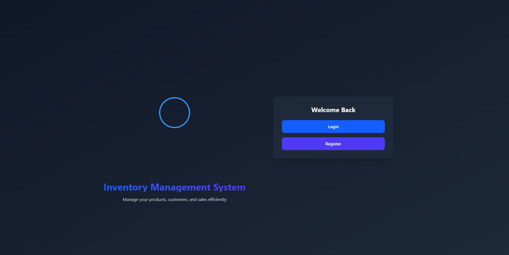

<h1 align="center">Inventory Management System</h1>

<p align="center">
  <strong>A modern full-stack inventory, sales, and customer management platform built with Next.js, MongoDB, and NextAuth.</strong>
</p>

<div align="center">
  
</div>

<p align="center">
  <a href="https://inventory-management-system-ten-pi.vercel.app/" target="_blank"></a>
  <a href="https://github.com/maksudulhaque2000/Inventory-Management-System" target="_blank"></a>
  <a href="https://maksudul-haque.vercel.app/" target="_blank"></a>
  <a href="https://www.linkedin.com/in/maksudulhaque2000/" target="_blank"></a>
  <a href="https://www.facebook.com/maksudulhaque2000" target="_blank"></a>
  <a href="https://www.youtube.com/@maksudulhaque2000" target="_blank"></a>
</p>

## Overview

Inventory Management System is a production-ready business dashboard for managing products, customers, sales transactions, payments, and analytics in one place. The application supports secure authentication, real-time inventory operations, credit tracking, invoice generation, and business performance monitoring through interactive charts and summary cards.

It is designed for small and medium businesses that need a clean workflow for stock control, customer records, and sales bookkeeping with a modern user experience.

## Key Features

- Secure authentication with local credentials and OAuth support for Google and Facebook.
- Inventory management with add, update, delete, search, and stock control functionality.
- Customer management with full CRUD operations and customer-level purchase statistics.
- Sales workflow that connects products and customers, validates stock availability, and updates inventory automatically after each sale.
- Partial payment support with outstanding balance tracking and payment status labels.
- Dashboard analytics with total inventory value, today’s purchases, today’s sales, outstanding credit, and profit snapshots.
- Sales trend visualization with daily, monthly, and yearly charts.
- PDF invoice generation for sales records.
- Profile management for user name, company name, and profile image.
- Dark and light theme support.
- Responsive layout optimized for desktop and mobile use.

## Tech Stack

### Frontend

- Next.js 16
- React 19
- TypeScript
- Tailwind CSS 4
- shadcn/ui primitives
- Framer Motion
- Recharts
- Lottie React

### Backend

- Next.js App Router API routes
- MongoDB
- Mongoose
- NextAuth.js 5
- JWT-based token handling for custom API sessions

### Utilities

- date-fns
- react-hot-toast
- SweetAlert2
- jsPDF
- bcryptjs

## Project Structure

- `app/` - App Router pages and API routes.
- `app/api/auth/` - Login, register, profile, OAuth, and session endpoints.
- `app/api/products/` - Product CRUD endpoints.
- `app/api/customers/` - Customer CRUD and customer statistics endpoints.
- `app/api/sales/` - Sales creation, listing, and payment update endpoints.
- `app/api/dashboard/` - Dashboard stats and sales graph data.
- `components/` - Shared layout, theme toggle, session wrapper, and UI components.
- `context/` - Authentication context provider.
- `lib/` - Database connection, authentication helpers, and theme utilities.
- `models/` - Mongoose models for users, products, customers, and sales.
- `public/` - Static assets, including the project preview image.

## Main Modules

### Authentication

The application supports:

- Email and password registration and login.
- OAuth sign-in with Google and Facebook.
- JWT generation and validation for protected endpoints.
- Session verification through `/api/auth/me` and profile token exchange for OAuth.

### Inventory

Products include:

- Product name
- Image URL
- Quantity in stock
- Purchase price
- Selling price

The product workflow allows searching, editing, deleting, and automatic quantity aggregation when the same product name is added again.

### Customers

Customer records store:

- Name
- Mobile number
- Address
- Profile image

The customer module also tracks total purchases and outstanding balances per customer.

### Sales

Sales records connect products and customers and store:

- Quantity sold
- Unit price
- Total amount
- Cash received
- Remaining amount
- Payment status
- Sale date

Sales can be created from the dashboard, updated with additional payments, and exported as PDF invoices.

### Dashboard

The dashboard shows:

- Total inventory value
- Today’s purchase value
- Today’s sales amount
- Outstanding credit
- Profit summary
- Inventory and payment health indicators
- Daily, monthly, and yearly sales charts

## Environment Variables

Create a `.env.local` file in the project root and define the following variables:

```env
MONGODB_URI=your_mongodb_connection_string
NEXTAUTH_SECRET=your_nextauth_secret
NEXTAUTH_URL=http://localhost:3000
GOOGLE_CLIENT_ID=your_google_client_id
GOOGLE_CLIENT_SECRET=your_google_client_secret
FACEBOOK_CLIENT_ID=your_facebook_client_id
FACEBOOK_CLIENT_SECRET=your_facebook_client_secret
```

## Installation

### 1. Clone the repository

```bash
git clone https://github.com/maksudulhaque2000/Inventory-Management-System.git
cd Inventory-Management-System
```

### 2. Install dependencies

```bash
npm install
```

### 3. Configure environment variables

Create `.env.local` and add the required variables from the section above.

### 4. Run the development server

```bash
npm run dev
```

Open the app at `http://localhost:3000`.

### 5. Build for production

```bash
npm run build
npm start
```

## Available Scripts

- `npm run dev` - Start the development server.
- `npm run build` - Build the application for production.
- `npm start` - Run the production server.
- `npm run lint` - Run ESLint checks.

## API Overview

### Authentication

- `POST /api/auth/login` - Login with email and password.
- `POST /api/auth/register` - Register a new user.
- `GET /api/auth/me` - Get the current user from a bearer token.
- `GET /api/auth/oauth` - Exchange an OAuth session for an app token.

### Profile

- `GET /api/user/profile` - Fetch the current user profile.
- `PUT /api/user/profile` - Update name, company name, and profile image.

### Products

- `GET /api/products` - List products with pagination and search.
- `POST /api/products` - Create a product or add stock to an existing product.
- `GET /api/products/[id]` - Get a single product.
- `PUT /api/products/[id]` - Update a product.
- `DELETE /api/products/[id]` - Delete a product.

### Customers

- `GET /api/customers` - List customers with pagination and search.
- `POST /api/customers` - Create a customer.
- `GET /api/customers/[id]` - Get a single customer.
- `PUT /api/customers/[id]` - Update a customer.
- `DELETE /api/customers/[id]` - Delete a customer.
- `GET /api/customers/[id]/stats` - Get customer purchase and outstanding totals.

### Sales

- `GET /api/sales` - List sales with pagination.
- `POST /api/sales` - Create a sale and reduce product stock.
- `PUT /api/sales/[id]` - Add an additional payment to a sale.

### Dashboard

- `GET /api/dashboard/stats` - Fetch summary metrics.
- `GET /api/dashboard/sales-graph` - Fetch daily, monthly, and yearly sales data.

## Authentication Flow

The app uses two related authentication flows:

1. Standard email/password login and registration return a JWT token that is stored in `localStorage` and sent in the `Authorization` header for API calls.
2. OAuth sign-in through NextAuth redirects to the callback page, which exchanges the authenticated session for an application token.

This approach keeps the UI session-aware while allowing the custom API routes to remain token-protected.

## Screenshots

The main visual preview is available at:

- `./public/preview.png`

## Live Links

- Live Demo: https://inventory-management-system-ten-pi.vercel.app/
- GitHub Repository: https://github.com/maksudulhaque2000/Inventory-Management-System
- Portfolio: https://maksudul-haque.vercel.app/
- LinkedIn: https://www.linkedin.com/in/maksudulhaque2000/
- Facebook: https://www.facebook.com/maksudulhaque2000
- YouTube: https://www.youtube.com/@maksudulhaque2000

## Author

**Maksudul Haque**

- GitHub: https://github.com/maksudulhaque2000
- Portfolio: https://maksudul-haque.vercel.app/
- LinkedIn: https://www.linkedin.com/in/maksudulhaque2000/

## License

No explicit license is included in this repository. If you plan to reuse or distribute this project, add an appropriate license file first.
